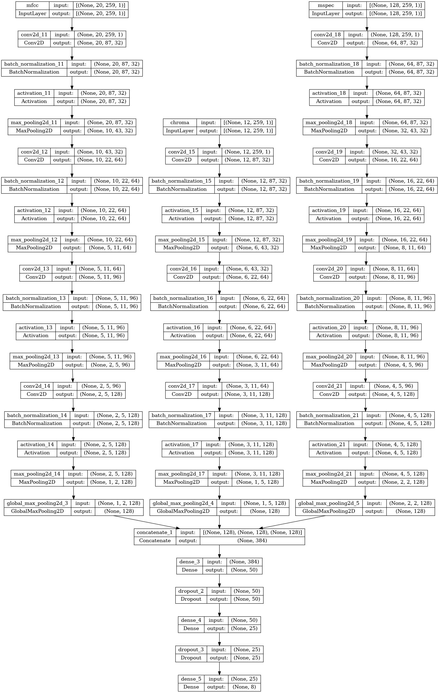

## 検証環境

- OS: ubuntu 22.04.1 LTS

- GPU: NVIDIA GeForce RTX 2060 SUPER

- CPU: Intel(R) Core(TM) i7-9700 CPU @ 3.00GHz

- メモリ: 32 GB

## 環境構築

0. dataset.zip をこのファイルと同じ階層で解凍する。ディレクトリ構成が下記のようになっていることを確認

   ```
   ./dataset
   |_Respiratory_Sound_Database
       |_Respiratory_Sound_Database
           |_Respiratory_Sound_Database
               |-audio_and_txt_files: 患者ごとのwavファイルとtxt
               |-filename_format.txt
               |-patient_diagnosis.csv
               |_tmp.txt
   ```

1. 下記のコマンドで docker を起動させる

   - gpu の場合

     ```
     docker-compose up
     ```

   - cpu の場合

     ```
     docker-compose -f docker-compose-cpu.yml up
     ```

2. `http://localhost:8888`にアクセスして、`notebooks`配下の notebook を順次実行していく(実行順で連番にしている。)。

## 使用モデル, 特徴量

- 特徴量

  - mfcc: https://qiita.com/tmtakashi_dist/items/eecb705ea48260db0b62

  - chromagram : https://qiita.com/namaozi/items/31ea255ecc6a04320dfc

  - melspectrogram: https://take-tech-engineer.com/pytorch-librosa-melspec/

- 使用モデル

  上記の 3 特徴量を入力としたモデル。

  それぞれの入力は、画像として扱うことが可能である。そのため、

  1. 2 次元畳み込みニューラルネットワークを通して一度特徴量マップを作成

  2. 作成した特徴量マップを GlovalMaxPooling2d で全結合層で扱えるように変換

  3. 全結合層で 8 細胞分類を実施

  というモデルとしている。

  具体的なモデルは、下記の通り。

  

## 課題

- 少数クラスの性能(病気のデータなので特に感度)があまりよくない。

  今回は、対策として学習時の重み付けを実施した。テストデータにおいて、Asthma は検出できている(重み付けを実施しない場合は検出できず。)。こちらは、同じ患者の異なる時間のデータなので少し問題があるかもしれない。

  対策として、

  **多数ラベルデータ(COPD)以外にデータ拡張を実施する。**

  が挙げられる。

  `https://github.com/iver56/audiomentations` のライブラリが扱いやすそう。

  学習時にデータ拡張を実施するか、学習前に実施するかも課題になる。

- しきい値の決め方: 多クラス分類のしきい値決め方がややこしい。健康 or 病気などにして考えると良いかもしれない。
